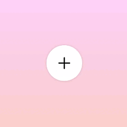

# CREANDO UN MENU DE NAVEGACIÓN CIRCULAR 
Esta practica consiste en la creacion de un menú circular de navegacion compuesto por un botón principal, circular, centrado, el cual al ser presionado comienza una animacion de girar su icono y despliega desde el centro 8 nuevos botones que orbitan al principal en el sentido de las manecillas del reloj.

Cada icono de los botones secundarios cambia de color al pasar el mouse sobre el.

Al presionar nuevamente el boton principal se ocultan los botones secundarios orbitando en el sentido opuesto a las manecillas del reloj y terminando detras del boton principal, regresando a la posicion inicial.

## TECNOLOGÍAS
---
Esta práctica es realizada utilizando **HTML, CSS, JAVASCRIPT**. Se compone de un div con clase menu que funciona como contenedor para 9 elementos, los cuales son: un segundo *div* con clase ***toggle*** que funcionara como boton principal y 8 elementos *li* que conforman los enlaces. Cada uno de estos elementos contiene su correspondiente icono, obtenido de **IONICONS.**

### Composicion del HTML
El div contenedor ***menu*** sirve para centrar todos los iconos empleando flexbox.

El div ***toggle*** adquiere border-radius de 50% para tomar forma circular, se posiciona hasta el frente de todos los elementos con z-index y contiene un icono que representa mas opciones.

Los atributos y valores necesarios para controlar la ubicacion, alineacion, rotacion y efectos de animacion para los botones del menú se aplican a los elementos de lista *li.*  

El comportamiento y apariencia de los iconos, asi como el tamaño, color y forma de los botones del menú se aplican a los enlaces *a.*

### Script de Javascript

Consiste de dos variables llamadas ***toggle*** y ***menu***, las cuales almacenan los nodos del documento con clase *toggle* y *menu* respectivamente; asi como de un escucha aplicado a la variable **toggle**, el cual al ser presionado desencadena una funcion que agrega o retira la clase ***active*** de la classList del nodo **menu**.

En el primer estado se muestra centrado el div ***toggle***, posicionado hasta el frente y escondiendo tras de el al resto de los botones del menu. Al ser presionado el div ***toggle***, se llama a la función de javascript y se comienzan las transiciones aplicadas a los elementos *li*  y al icono de toggle.

## TRANSICIONES AL AGREGAR LA CLASE "active"
---
Las transiciones de los elementos *li* consisten en desplazarse 100px hacia afuera y rotar 45° con respecto al elemento anterior. (0, 45, 90, 135, 180, 225, 270, 315).

Las transiciones del icono en el toggle consiste en girar 315 grados, con la finalidad de mostrarse como una equis que representa cerrar.

## TRANSICIONES AL RETIRAR LA CLASE "active"
---
Las transiciones de los elementos *li* y toggle consisten en revertir los desplazamientos anteriores para volver al estado inicial.